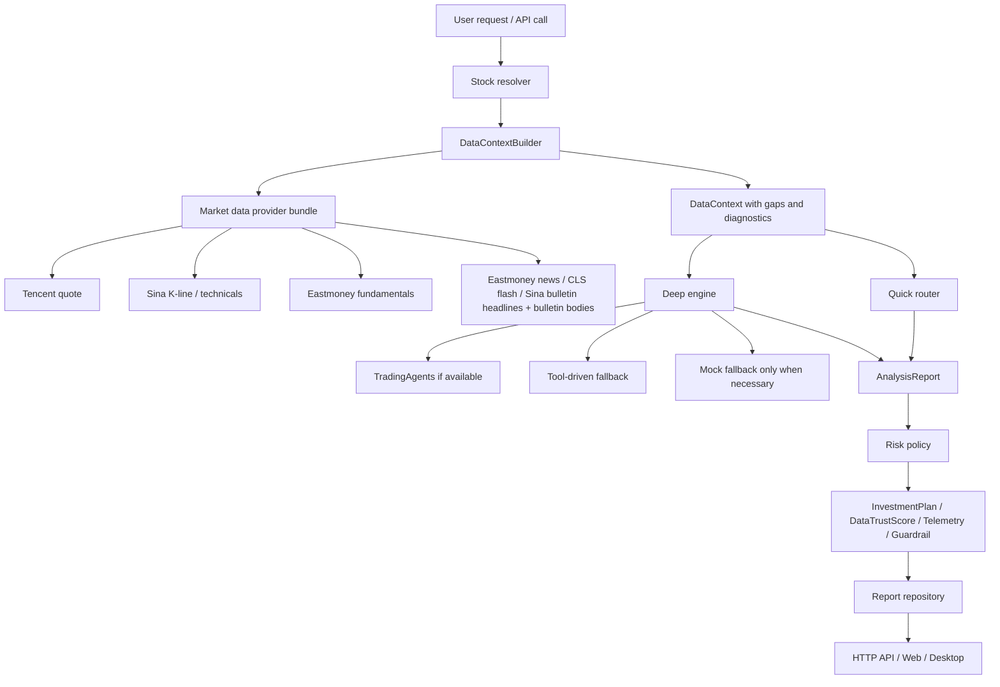

# Money_Never_sleep Architecture

## How To Use

Before starting any new task in this repository, read `@ARCHITECTURE.md` first.

If the task changes product scope, data sources, execution flow, or runtime behavior, update this file together with the stage/docs files.

## Core Modules

### 1. `services/api`

Backend runtime, orchestration, and domain logic.

- `money_api/api/http.py`: dependency-free JSON HTTP boundary.
- `money_api/api/v1/router.py`: runtime service factories and top-level API functions.
- `money_api/domains/analysis/`: analysis contracts, reporting, task queue, risk policy, backtest, provenance, and engine adapters.
- `money_api/domains/market_data/`: online data providers and provider result contracts.
- `money_api/integrations/`: optional external engine adapters such as TradingAgents.

### 2. `apps/web`

Zero-dependency web shell.

- Reads analysis reports, task state, diagnostics, and provenance.
- Supports local mock mode and HTTP API mode.
- Displays engine source, fallback reason, data sources, and structured events.

### 3. `apps/desktop`

Electron desktop shell.

- Hosts or connects to the Python API service.
- Exposes startup diagnostics and runtime mode visibility.

### 4. `docs`

Long-term project memory.

- `docs/stages.md`: stage status and validation summary.
- `docs/agent-handoff.md`: working memory for the next agent.
- `docs/decision-log.md`: short decision history per work slice.
- `docs/improvement-backlog.md`: postponed work and technical debt.
- `docs/reference-integration-map.md`: how the three reference repos are used.
- `docs/information-map.md`: navigation map for future tasks.

## Data Flow

## Design Principles

- Online first, but fail open with explicit provenance.
- Never hide fallback; always surface `data_sources`, `engine_source`, `engine_mode`, and `fallback_reason`.
- Prefer thin, reusable slices: bulletin headlines can be enriched with bulletin bodies before introducing a new data family.
- Keep Money_Never_sleep as its own platform boundary; reference repos are assets, not direct forks.
- Prefer small, testable increments over broad rewrites.
- Do not introduce real trade execution in the first stage.
- Preserve stable domain contracts and extend them instead of replacing them.
- If data is missing or uncertain, record the gap rather than fabricating a value.

## Reference Repo Policy

The following repositories are long-term architecture assets:

- `ArvinLovegood/go-stock`
- `simonlin1212/TradingAgents-astock`
- `ZhuLinsen/daily_stock_analysis`

When a task borrows from them, document:

- what is copied,
- what is adapted,
- what is redesigned,
- why a direct fork is not used.

Record that in `docs/reference-integration-map.md` and the decision log.

## Working Rule

For every new task:

1. Read `@ARCHITECTURE.md`.
2. Read the relevant stage/doc pages.
3. Make the smallest change that solves the current problem.
4. Update docs after the work is done.
